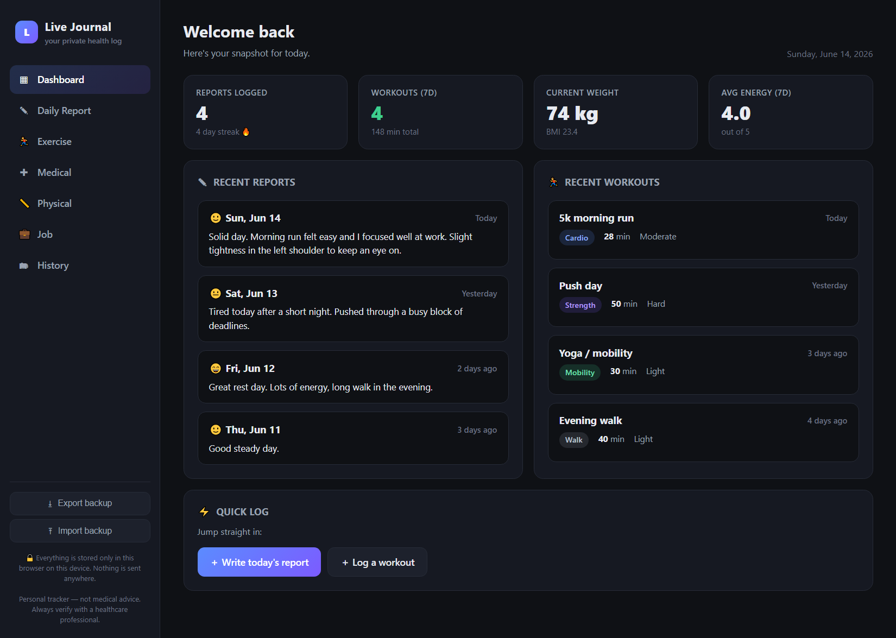
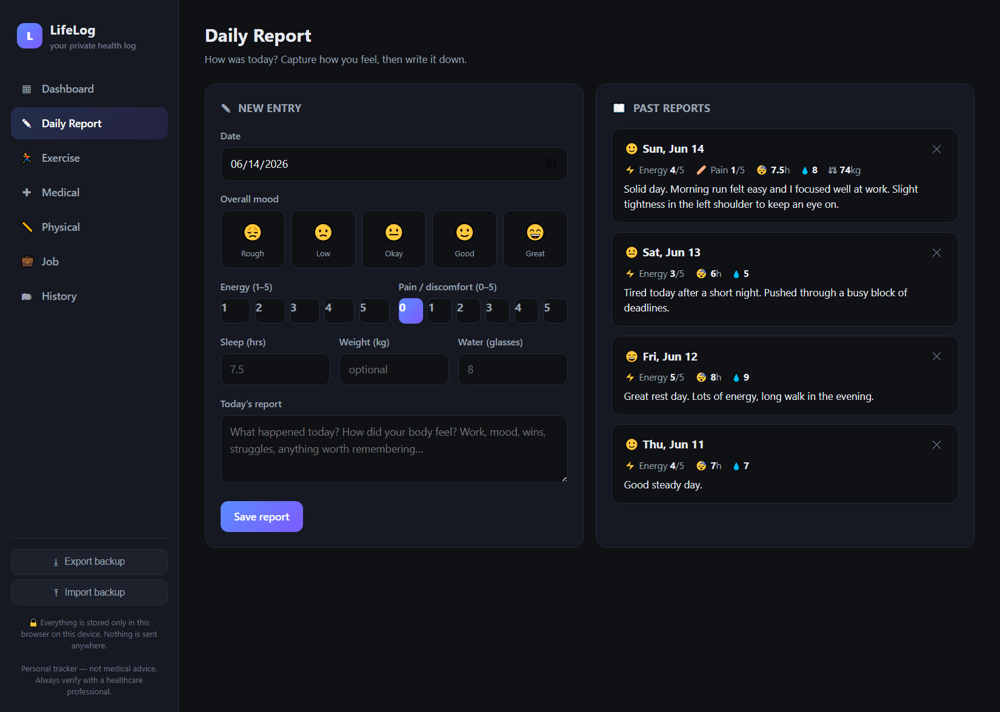
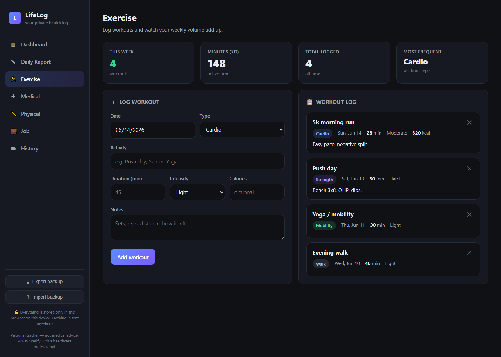
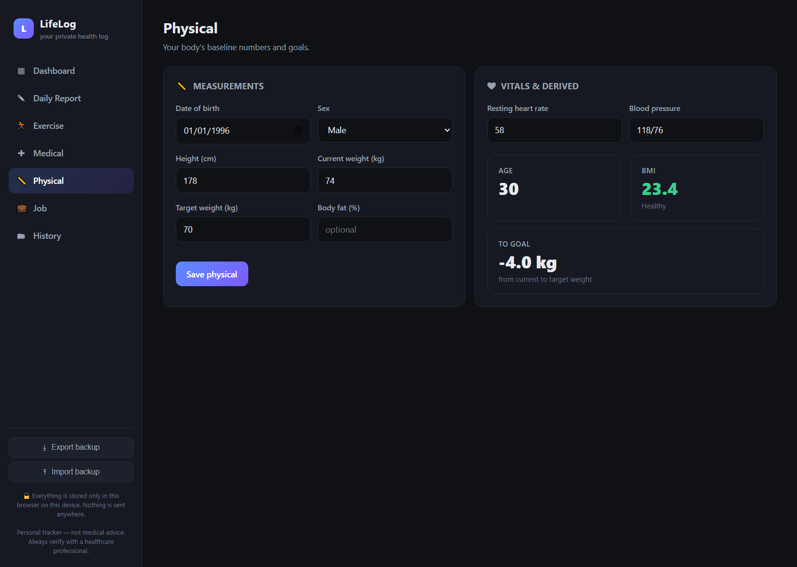
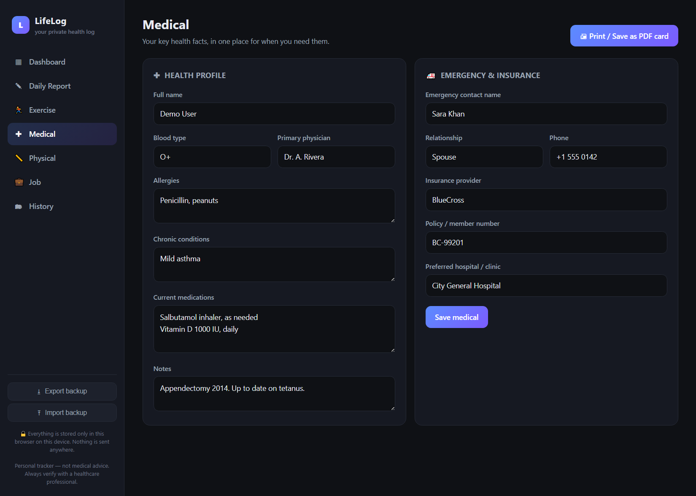

# LifeLog — Personal Health & Life Tracker

A clean, private, single-file web app for tracking your **medical**, **physical**, **job**, and **exercise** details and writing **daily reports**. No accounts, no servers, no install — just open the file in your browser.

  

**▶ Live demo: [umerniazi96.github.io/lifelog](https://umerniazi96.github.io/lifelog/)**

*(Screenshot shows sample data — the app starts empty and stores everything locally in your browser.)*

## ✨ Features

- **Dashboard** — at-a-glance stats: report streak, weekly workouts & active minutes, current weight + BMI, average energy.
- **Daily Report** — mood, energy & pain scales, sleep, water, weight, and a free-form journal entry.
- **Exercise log** — workouts by type, duration, intensity, calories, and notes, with weekly volume totals.
- **Medical** — blood type, allergies, conditions, medications, physician, emergency contact, insurance.
- **Physical** — height, weight, target, vitals, with auto-calculated age, BMI, and distance to goal.
- **Job** — title, employer, schedule, hours, stress level.
- **History** — a unified timeline of everything you've logged.
- **🖨 Printable medical card** — generate a clean one-page summary; "Save as PDF" for doctor visits.
- **Backup & restore** — export/import your data as a JSON file.

## 🧭 How it works

LifeLog is organised into simple sections you reach from the sidebar. Everything you type is saved instantly to your browser — there's no "sync" or sign-in step.

### 1. Write a daily report
Pick your mood, rate energy and pain on quick 1–5 scales, jot sleep / water / weight, and write a free-form note. Past entries build up in the timeline on the right, and consecutive days form a streak.

### 2. Log your workouts
Record each session by type (cardio, strength, mobility, sport, walk…), with duration, intensity, calories and notes. The cards at the top tally your weekly workouts, active minutes, and most-frequent type automatically.

### 3. Keep your physical profile
Enter height, weight, target and vitals once — LifeLog derives your **age, BMI (colour-coded), and distance to your goal weight** for you. Logging weight in a daily report updates this automatically.

### 4. Store key medical info — and print it
Blood type, allergies, conditions, medications, emergency contact and insurance live in one place. The **🖨 Print / Save as PDF** button turns it into a clean one-page medical card to hand a doctor or keep in your wallet.

### 5. Back up your data
Use **Export backup** to download a `.json` of everything, and **Import backup** to restore it — handy for moving between devices or browsers, since data otherwise stays on one device.

## 🔒 Privacy

All data is stored **only in your browser** via `localStorage`, on your own device. Nothing is ever uploaded or transmitted. The published app file contains **no personal data** — your entries never leave your machine.

> ⚠️ Because data lives in browser storage, clearing your browser's site data will erase it. **Export a backup regularly.**

## 🚀 Usage

1. Download [`index.html`](index.html).
2. Double-click to open it in any modern browser.
3. Start logging. That's it.

To use it across devices, export a backup on one device and import it on another.

## 🌐 Hosting a public link (optional)

Since it's a static file, you can host it free anywhere:

- **Netlify Drop** — drag `index.html` onto <https://app.netlify.com/drop>.
- **GitHub Pages** — enable Pages on this repo (Settings → Pages → deploy from `main`).
- **Cloudflare Pages / Vercel** — point at this repo.

## ⚕️ Disclaimer

This is a personal organization tool, **not medical advice or a medical device**. Always verify health information with a qualified professional.

## License

[MIT](LICENSE) — free to use, modify, and share.
